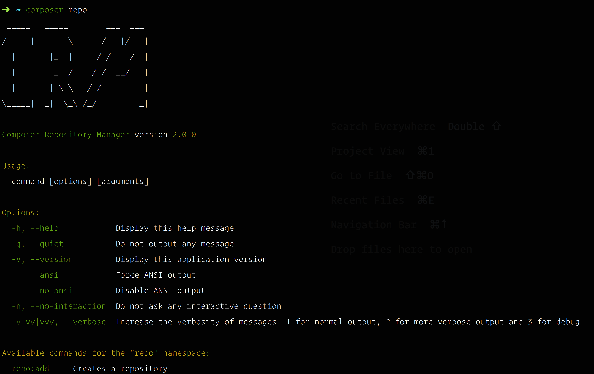
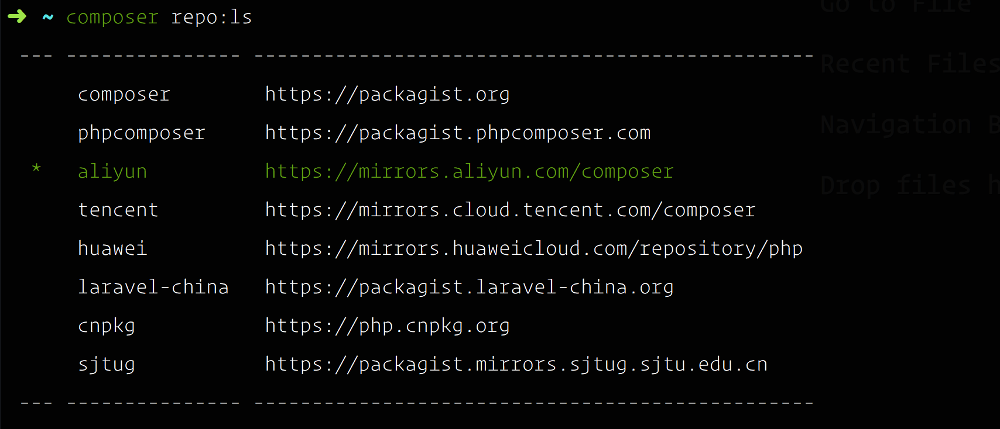

## 配置 Composer

### Composer 源管理工具 [CRM](https://github.com/slince/composer-registry-manager)

#### 安装

```
composer global require slince/composer-registry-manager
```

通过上面的命令，可以得到命令 `composer repo`



#### 配置 [CRM](https://github.com/slince/composer-registry-manager)

```
composer repo:use aliyun
```

> 通过上面的命令配置镜像地址为 `aliyun`

```
composer repo:ls # 查看所有镜像地址

composer repo:use $Mirror # 在列表中选择镜像地址，其中 $Mirror 为列表项
```



至此，[CRM](https://github.com/slince/composer-registry-manager) 安装完毕。

#### 安装报错

```
Peer's certificate issuer has been marked as not trusted by the user.
```

在安装的过程中 报错：[Peer's certificate issuer has been marked as not trusted by the user.](https://discuss.devopscube.com/t/solved-git-github-peers-certificate-issuer-has-been-marked-as-not-trusted-by-the-user/474)

```
git config --global http.sslVerify false
```

> 通过设置上面的 git 配置，可以忽略 ssl 的检查。


### 多线程下载 [hirak/prestissimo](https://github.com/hirak/prestissimo)

```
composer global require hirak/prestissimo
```

### 自动部署工具 [deployer/deployer](https://github.com/deployphp/deployer)

```
composer global require deployer/deployer deployer/recipes curder/deployphp-recipes --no-progress --profile --prefer-dist
```

```
composer global require phpunit/phpunit laravel/installer friendsofphp/php-cs-fixer squizlabs/php_codesniffer --no-progress --profile --prefer-dist
```
