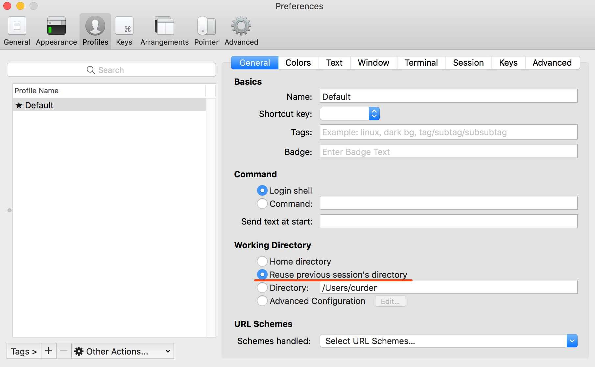
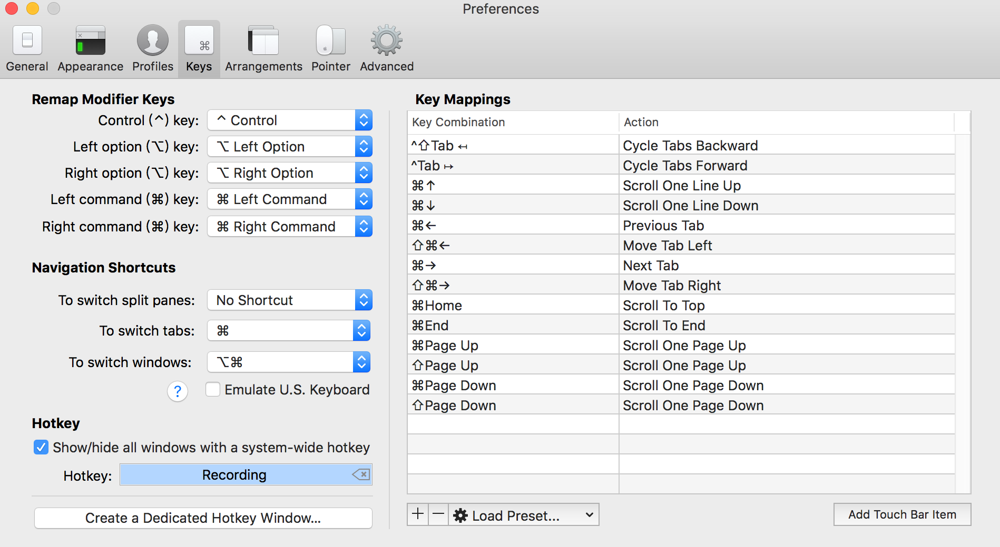

# 简单配置 iTerm2

[安装 iTerm2](/install/iterm2.md)

使用快捷键 `Command + ,` 打开 iTerm2 的设置。

## 打开新窗口停留在上一次的路径

- 快捷键 `Command+,` ->> `Profiles` ->> 选中当前项目名 ->> 选择`Reuse Pevious session's directory`



## 修改字体大小和行间距

- 快捷键 `Command+,` ->> `Profiles` ->> 选中当前项目名 ->> 在右侧 Tabs 中选择 Text 选项 ->> 找到 Font 选项，点击进入字体配置。

字体大小选择为： `16pt`，行间距为：`130%`。


## 设置快速切换快捷键

- 快捷键 `Command+,` ->> 选择 `Keys` ->> 找到 HotKey，并点击记录你的快捷键，我这里使用的是 **Command + \`**



设置好快捷键之后，在任意界面使用快捷键都能快速切换 iTerm2。

## 设置正确的SSH连接字符集

当我们需要使用SSH连接远程服务器，会报如下错误：

::: danger 报错
-bash: warning: setlocale: LC_CTYPE: cannot change locale (UTF-8): No such file or directory
:::

在 `/etc/ssh/ssh_config` 文件的末尾，将 `SendEnv LANG LC_*` 使用`#`注释，添加指定的字符集 `SendEnv LANG LC_ALL=en_US.UTF-8`，如下：

``` {2,3}
Host *
        #SendEnv LANG LC_* # 注释默认配置
        SendEnv LANG LC_ALL=en_US.UTF-8 # 添加这一行
```

相关链接，[查看这里](https://segmentfault.com/a/1190000022755839)
