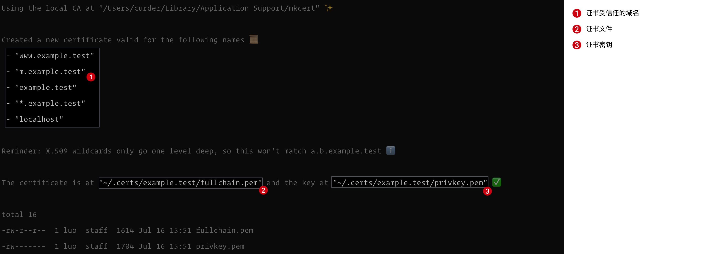
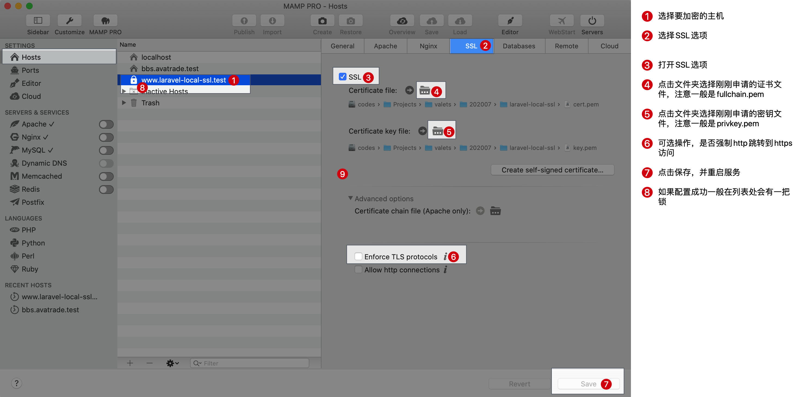

# mkcert

### 初始化配置

```bash
mkcert -install
```

### 创建统一存放目录

```bash
mkdir -p ~/.certs/ # 创建对应存放目录

ls -l ~/.certs # 查看目录是否存在
```

### 生成证书

```bash
export ssl_path=~/.certs
export domain=example.test

mkdir -p ${ssl_path}/${domain} # 创建证书对应目录

mkcert -key-file ${ssl_path}/${domain}/privkey.pem \
       -cert-file ${ssl_path}/${domain}/fullchain.pem \
       "www.${domain}" "m.${domain}" "${domain}" "*.${domain}" "localhost"

# ls -l `echo ${ssl_path}/${domain}` # 查看证书文件
# ls -ld `echo ${ssl_path}/${domain}` # 证书所在路径
```

> 在执行上面命令的时候，`ssl_path`可以选择合适的证书存放的路径，`domain` 根据实际情况定义，**可以根据实际情况后期增减重新执行命令生成**。

下图是执行成功的一些信息。




### Nginx配置SSL证书

以MAMP客户端为例。

1. 选择要加密的主机
2. 选择SSL选项
3. 打开SSL选项
4. 点击文件夹选择刚刚申请的证书文件，注意一般是`fullchain.pem`
5. 点击文件夹选择刚刚申请的密钥文件，注意一般是`privkey.pem`
6. 可选操作，是否强制`http`跳转到`https`访问
7. 点击保存，并重启服务
8. 如果配置成功一般在列表处会有一把锁




### 在`laravel-mix`项目中使用

```js
mix.browserSync({
    proxy: "https://www.example.com",
    https: {
        key: "~/.certs/example.com/privkey.pem",
        cert: "~/.certs/example.com/fullchain.pem"
    }
});
```

> 配置之前需要保证`https://example.com`能正常访问。
>
> `key` 和 `cert` 的配置跟当前生成证书时指定的文件保持一致。

### 在 Docker nginx 中使用

在项目的配置文件中添加如下样例代码：

```nginx
server {
    listen       80;
    server_name  example.com;
    return 301 https://$server_name$request_uri;
}

server {
    listen       443 ssl;
    server_name  example.com;

    # 容器中公、私钥对应路径
    ssl_certificate     /etc/nginx/ssl/example.com/fullchain.pem;
    ssl_certificate_key /etc/nginx/ssl/example.com/privkey.pem;

    root   /usr/share/nginx/html;
    index  index.html index.htm;

    # ...
}
```

[Nginx SSL配置](https://ssl-config.mozilla.org/#server=nginx&version=1.17.7&config=intermediate&openssl=1.1.1k&ocsp=false&guideline=5.6)