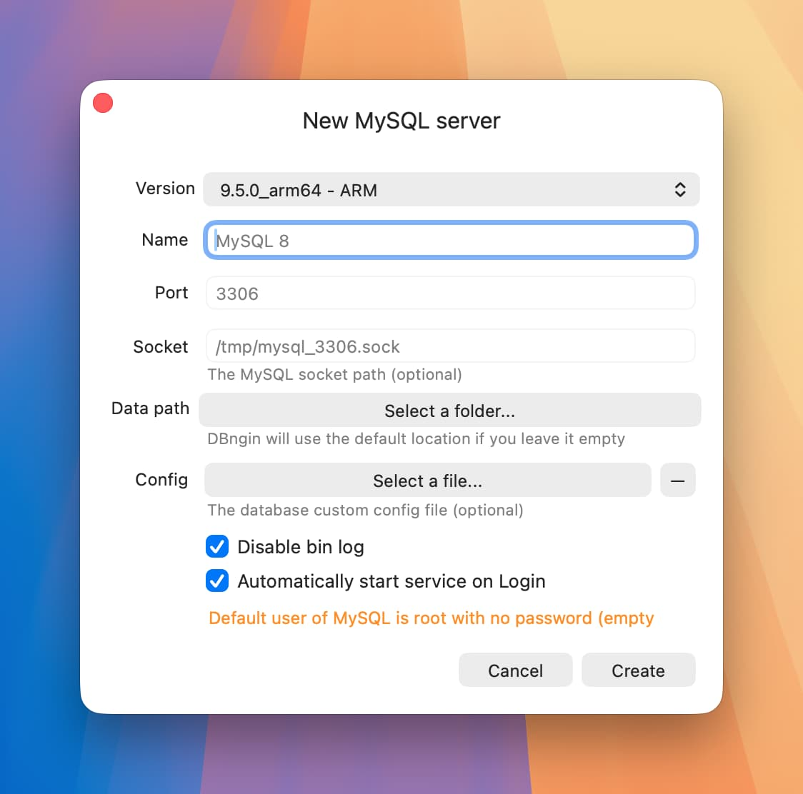
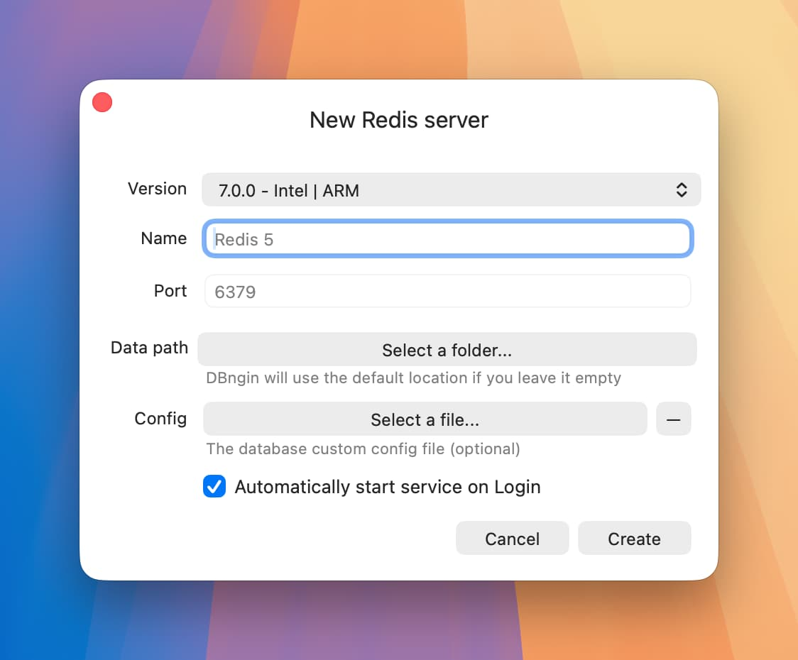

# Database {#database}

数据库是软件系统中非常重要的组成部分，开发中常用的关系型数据库可以安装 MySQL，非关系型数据库可以安装 Redis。

在本节中，将介绍如何安装 Redis 和 MySQL 数据库。

## 安装 DBngin {#install-dbngin}

[DBngin](https://dbngin.com/) 是一个数据库管理工具，它可以帮助启动 Redis，同时它也能快速的启动 MySQL 和 PostgreSQL。

```shell
brew install --cask dbngin
```

## 启动 MySQL {#start-mysql}

MySQL 是最流行的关系型数据库，在开发和生产环境中都得到了广泛的应用。

打开 DBngin，点击添加一个 MySQL 服务，版本选择 8.0.32，然后点击创建。



:::info MySQL 默认的数据库用户名是 `root`，密码是空。
:::

## 启动 Redis {#start-redis}

Redis 作为最流程的内存数据库，在开发和生产环境中都得到了广泛的应用。

打开 DBngin，点击添加一个 Redis 服务，版本选择 7.0.0，然后点击创建。



除此之外，DBngin 还支持其他数据库的安装和管理，例如 PostgreSQL、MariaDB 等，开发者可以根据项目需求选择合适的数据库进行安装和管理。