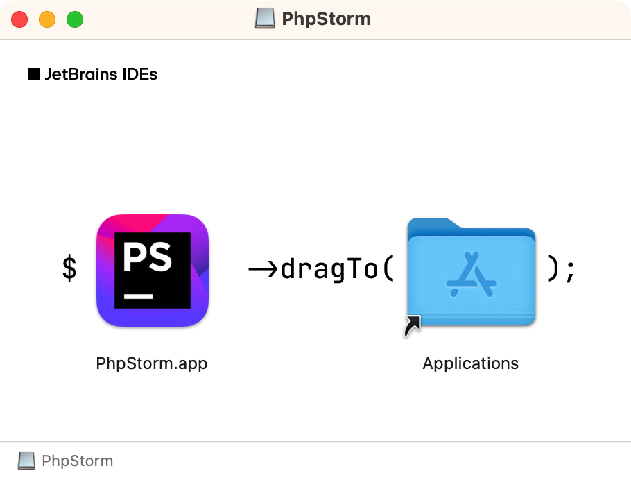
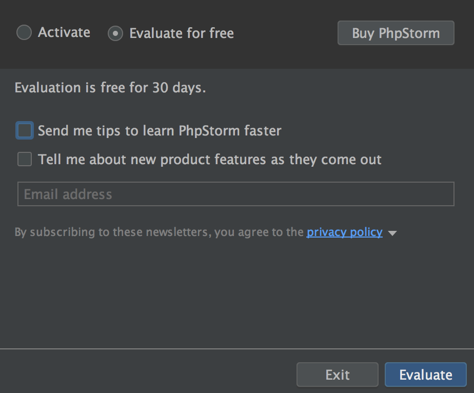
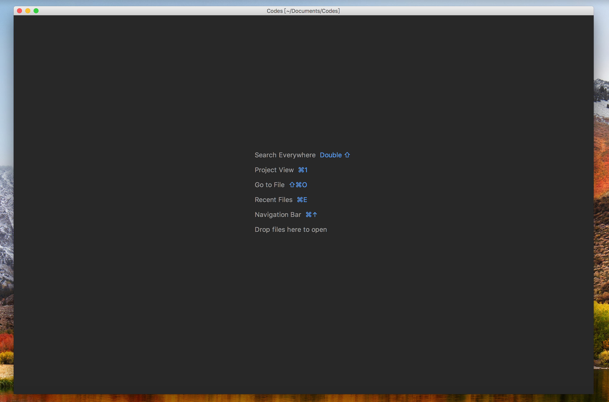
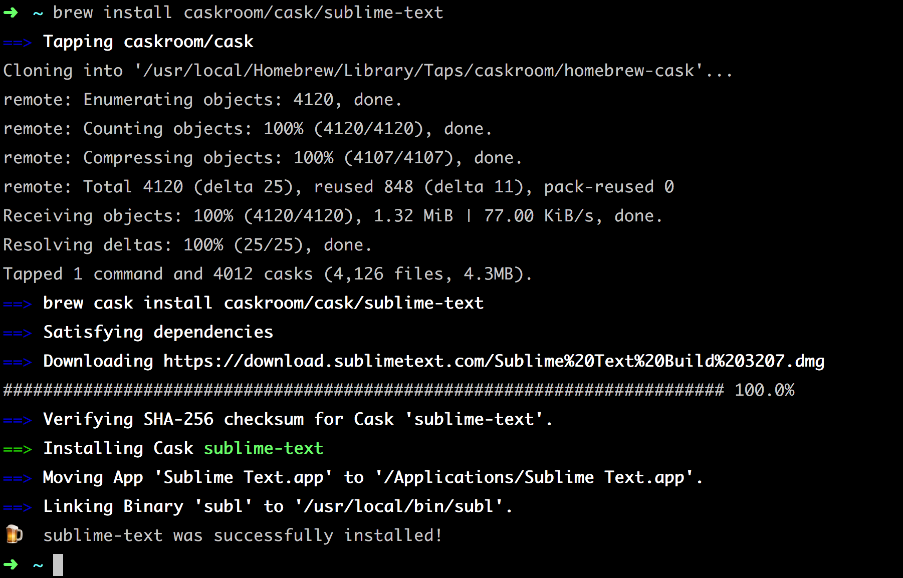
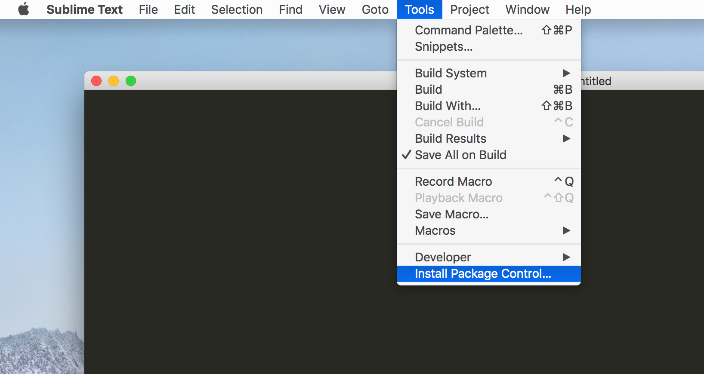

# Editor {#editor}

工欲善其事，必先利其器。选择一个合适的编辑器对于开发效率的提升是非常有帮助的。

## PhpStorm {#phpstorm}

PhpStorm 的下载请到[官方下载地址](https://www.jetbrains.com/phpstorm/download/)，默认会选中当前的操作系统平台，点击 **Download** 开始下载。

比如，这里下载的是 `PhpStorm-2024.1.3-aarch64.dmg` 文件。

双击下载好的安装包，出现下面的界面



将 `PhpStorm` 拖拽到右边的 `Applications` 文件夹里。

拖拽完成之后，来到 `Launchpad` 中找到 `PhpStorm` 的图标，单击打开它。



如上，这里选择试用 30 天体验。

至此，下载和安装已经完成。

### 简单配置 {#simple-setting}

修改默认主题
默认的操作界面是白色的，一般情况下会将其修改为黑色。

使用快捷键 `Command + Shift + a` 输入 `theme:` ，点击回车进入配置界面 -> `Theme` 一栏中选择 `Darcula`。

#### 隐藏或显示工具栏 Toolbar {#hide-or-show-toolbar}

提供两种方式操作：

1. 使用快捷键`Command + Shift + a` 输入`Toolbar`，按回车来切换显示和隐藏。

2. `Views`->`Toolbar` ，点击隐藏，再次点击则显示。

#### 隐藏或显示工具按钮 Tool Buttons {#hide-or-show-tool-buttons}

提供两种方式操作：

1. 使用快捷键`Command + Shift + a` 输入`Tool Buttons`，按回车来切换显示和隐藏。

2. `Views`->`Tool Buttons` ，点击隐藏，再次点击则显示。

#### 隐藏或显示状态栏 Status Bar {#hide-or-show-status-bar}

提供两种方式操作：

1. 使用快捷键`Command + Shift + a` 输入`Status Bar`，按回车来切换显示和隐藏。

2. `Views`->`Status Bar`，点击隐藏，再次点击则显示。

#### 隐藏或显示文件导航 Navigation Bar {#hide-or-show-navigation-bar}

提供两种方式操作：

1. 使用快捷键`Command + Shift + a` 输入`Navigation Bar`，按回车来切换显示和隐藏。

2. `Views` -> `Navigation Bar` 点击隐藏，再次点击则显示。

#### 显示或者隐藏代码行号 Line Numbers {#hide-or-show-line-numbers}

使用快捷键 `Command + Shif + a` 输入 `Show Line Numbers`，按回车来切换显示和隐藏。

#### 显示或隐藏文件导航 Breadcrumbs {#hide-or-show-breadcrumbs}

提供两种方式操作：

1. 使用快捷键`Command + Shift + a` 输入 `Show Breadcrumbs` ，点击回车来切换显示和隐藏。

2. 来到 `Preferences`（快捷键`Command + ,`）-> `Editor` -> `General` -> `Breadcrumbs`，将右侧配置中的 `Show breadcrumbs` 前面的勾选去掉即可隐藏，勾选则启用。

#### 显示或隐藏文件标签 Tabs Placement {#hide-or-show-tabs-placement}

使用快捷键 `Command + Shift + a` 输入 `Tabs Placement`, 点击 `Tabs Placement: None` 来隐藏。

如果需要显示可以根据需要选择左侧 `Tabs Placement: Left`，右侧 `Tabs Placement: Right` ，上面 `Tabs Placement: Top` 和底部 `Tabs Placement: Bottom`。

#### 显示或隐藏代码小地图 CodeGlance {#hide-or-show-code-glance}

代码小地图使用插件 `CodeGlance` ，安装插件这里不介绍，只介绍如何隐藏或显示小地图。

使用快捷键 `Command + Shift + a` 输入 `Toggle CodeGlance`, 按回车来切换显示和隐藏。

或者也可以使用快捷键 `Command + Shift + g` 来快速切换隐藏和显示。

#### 显示或隐藏代码区域的浏览器 browser popup in the editor {#hide-or-show-browser-popup-in-the-editor}

使用快捷键`Command + Shift +a` 输入 `Show browser popup in the editor`，进入 `Web Browsers` 的切换，将底部 `Show browser popup in the editor` 的选项勾选去掉即可。

#### 显示或隐藏空白字符 WhiteSpaces {#hide-or-show-white-spaces}

使用快捷键 `Command + Shift + a` 输入 `Show WhiteSpaces` 来快速切换显示和隐藏。

#### 设置代码自动换行 Use Soft Wraps {#use-soft-wraps}

使用快捷键 `Command + Shift + a` 输入 `Use Soft Wraps` 来快速切换自动显示的选项。

### 设置预览 {#custom-setting-preview}

以上设置全部进行简单的编辑器设置，可以看到如下的预览界面




## Sublime Text {#sublime-text}

Sublime Text 是一个功能强大的文本编辑器，它具有快速、可自定义和跨平台的特点。

Sublime Text 的[官方网站](https://www.sublimetext.com/)，找到适合自己的平台进行下载并安装。

也可以选择使用 Homebrew 进行安装。

```shell
brew install --cask sublime-text
```



> 从命令行的提示中可以看出默认已经建立了一个 `subl` 的软连接，后期在使用中可以在命令行直接呼出 sublime text。

### 安装插件管理 {#install-package-control}

- 在 `Sublime Text` 顶级菜单的 `Tools` 下点击 `Install Package Control...`，稍等片刻即可安装成功。如下图：
  

- 使用快捷键`⌘(Command) + ⇧(Shift) + P`，输入 `Install Package Control` 字符后点击回车完成安装。

### 插件管理 {#package-control}

通过`Package Control`能很方便的安装其它插件。

使用快捷键`Command + Shift + p`后输入下面对应的关键字可以对插件进行管理：

- `Install Package` 安装插件
- `Remove Package` 移除插件
- `Disable Package` 禁用插件
- `Enable Package` 启用插件
- `Upgrade Package` 更新插件
- `List Package` 插件列表

比如需要安装`Emmet`插件，可以使用快捷键`Command + Shift + p`，输入`Install Package`字符后再输入要安装的插件名称 `Emmet` 回车等待安装完成。

### 插件推荐 {#recommended-plugins}

- [A File Icon](https://packagecontrol.io/packages/A%20File%20Icon)
- [Emmet](https://packagecontrol.io/packages/Emmet)
- [MarkdownPreview](https://packagecontrol.io/packages/MarkdownPreview)
- [Material Theme](https://packagecontrol.io/packages/Material%20Theme)
- [Laravel Blade Highlighter](https://github.com/Medalink/laravel-blade)
 
