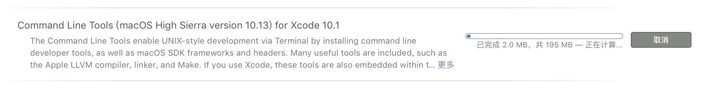

# Homebrew

[Homebrew](https://brew.sh/zh-cn) 是 MacOS 上缺失的软件包的管理器，安装它之后可以在命令行终端安装常见的依赖或软件。

初始化开发环境的第一个安装的软件应该就是 Homebrew，它可以简化后续软件的安装。

::: warning 注意
本文所有的命令都需要在 MacOS 系统默认终端 Terminal 下运行。
:::

## 系统依赖

在安装 Homebrew 之前需要安装 `Xcode Command Line Tools`，使用命令：


```bash
xcode-select --install
```

在执行命令的时候会一直停留在这行提示上，`Downloading Command Line Tools (macOS High Sierra version 10.13) for Xcode`。

需要耐心等待，如果失败了也可以在 Apple 官网下载`.dmg`文件进行安装。



## 安装

在命令行终端执行下面的命令安装 Homebrew。

::: code-group
```bash [从阿里云镜像安装]
# 从 Aliyun 下载安装脚本并安装 Homebrew 
git clone https://mirrors.aliyun.com/homebrew/install.git brew-install
/bin/bash brew-install/install.sh
rm -rf brew-install
```

```bash [使用 Gitee 地址下载]
# 从 Gitee 下载中文安装脚本并安装 Homebrew
/bin/zsh -c "$(curl -fsSL https://gitee.com/cunkai/HomebrewCN/raw/master/Homebrew.sh)"
```

```bash [使用 GitHub 地址下载]
# 从 GitHub 获取官方安装脚本安装 Homebrew 
/bin/bash -c "$(curl -fsSL https://raw.githubusercontent.com/Homebrew/install/HEAD/install.sh)"
```
:::

## 查看版本

安装完成后，在终端输入 `brew -v` 命令，如果出现版本号，则说明安装成功。

```bash
brew -v
```

## 常用命令

使用下面的常用命令命令对软件进行管理和维护。

| 命令 | 说明 |
| ---- | ---- |
| `brew update` | 更新 Homebrew |
| `brew list` | 查看已安装软件包 |
| `brew outdated` | 查看已过时软件包 |
| `brew search packageName` | 搜索软件包 |
| `brew install packageName` | 安装软件包 |
| `brew upgrade packageName` | 更新软件包 |
| `brew info packageName` | 查看软件包信息 |
| `brew uninstall packageName` | 卸载软件包 |
| `brew install --cask packageName` | 安装 cask 软件 |
| `brew uninstall --cask packageName` | 卸载 cask 软件 |


## 设置镜像源

下面以设置阿里源为例，也可以选择例如[清华大学开源软件镜像站](https://mirrors.tuna.tsinghua.edu.cn/help/homebrew/)等其他镜像源。

### 临时替换

在命令行终端执行下面的命令临时修改镜像源为阿里云的镜像源。

```bash
export HOMEBREW_INSTALL_FROM_API=1
export HOMEBREW_API_DOMAIN="https://mirrors.aliyun.com/homebrew-bottles/api"
export HOMEBREW_BREW_GIT_REMOTE="https://mirrors.aliyun.com/homebrew/brew.git"
export HOMEBREW_CORE_GIT_REMOTE="https://mirrors.aliyun.com/homebrew/homebrew-core.git"
export HOMEBREW_BOTTLE_DOMAIN="https://mirrors.aliyun.com/homebrew/homebrew-bottles"
brew update
```

### 永久替换

在命令行终端执行下面的命令永久修改镜像源为阿里云的镜像源，使用不同终端的用户选择不同的命令执行。

::: code-group

```zsh [zsh 终端用户]
echo 'export HOMEBREW_API_DOMAIN="https://mirrors.aliyun.com/homebrew-bottles/api"' >> ~/.zshrc
echo 'export HOMEBREW_BREW_GIT_REMOTE="https://mirrors.aliyun.com/homebrew/brew.git"' >> ~/.zshrc
echo 'export HOMEBREW_CORE_GIT_REMOTE="https://mirrors.aliyun.com/homebrew/homebrew-core.git"' >> ~/.zshrc
echo 'export HOMEBREW_BOTTLE_DOMAIN="https://mirrors.aliyun.com/homebrew/homebrew-bottles"' >> ~/.zshrc
source ~/.zshrc
brew update
```

```bash [bash 终端用户]
echo 'export HOMEBREW_API_DOMAIN="https://mirrors.aliyun.com/homebrew-bottles/api"' >> ~/.bash_profile
echo 'export HOMEBREW_BREW_GIT_REMOTE="https://mirrors.aliyun.com/homebrew/brew.git"' >> ~/.bash_profile
echo 'export HOMEBREW_CORE_GIT_REMOTE="https://mirrors.aliyun.com/homebrew/homebrew-core.git"' >> ~/.bash_profile
echo 'export HOMEBREW_BOTTLE_DOMAIN="https://mirrors.aliyun.com/homebrew/homebrew-bottles"' >> ~/.bash_profile
source ~/.bash_profile
brew update
```

:::

### 恢复默认配置

出于某些场景, 可能需要回退到默认配置, 可以通过在命令行执行下面的方式回退到默认配置。

```bash
# 1. 删除环境变量
unset HOMEBREW_BREW_GIT_REMOTE

# 2. 重新设置 Homebrew 代码仓库地址
git -C "$(brew --repo)" remote set-url origin https://github.com/Homebrew/brew

# 3. 如果之前永久配置了 HOMEBREW 环境变量，还需要在对应的 `~/.bash_profile`
#    或者 `~/.zshrc` 配置文件中，将 Homebrew 对应的环境变量配置行删除

# 4. 更新 Homebrew
brew update
```


## 测试

以安装常用的命令 `wget` 为例进行测试：

```bash
brew install wget
```

::: tip **注意：**
针对使用 Intel 芯片系列的电脑，软件包可执行文件软链接到 `/usr/local/bin`。

苹果自研 ARM 架构的 CPU，软件包可执行文件软链接到 `/opt/homebrew/bin`。
:::

## 推荐软件

安装一些开发中常用的软件包，例如：

```bash
brew install libzip \
 libpq \
 mozjpeg \
 pngquant \
 wget \
 autoconf \
 openssl \
 libjpeg \
 libpng \
 lzlib \
 curl \
 imap-uw \
 readline \
 postgresql \
 libxml2 \
 gettext \
 libxslt \
 libiconv \
 icu4c \
 expat \
 bison \
 webp \
 freetype \
 tree \
 pkg-config \
 zzz \
 telnet --verbose
```

> [`zzz`](https://formulae.brew.sh/formula/zzz) 用于在命令行终端快速将电脑休眠。
