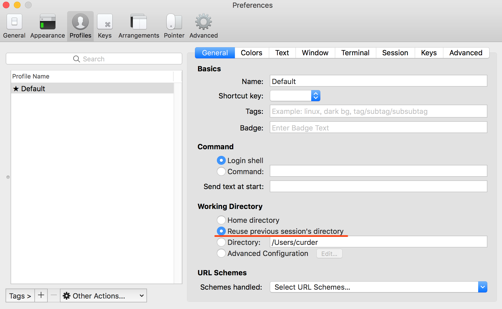
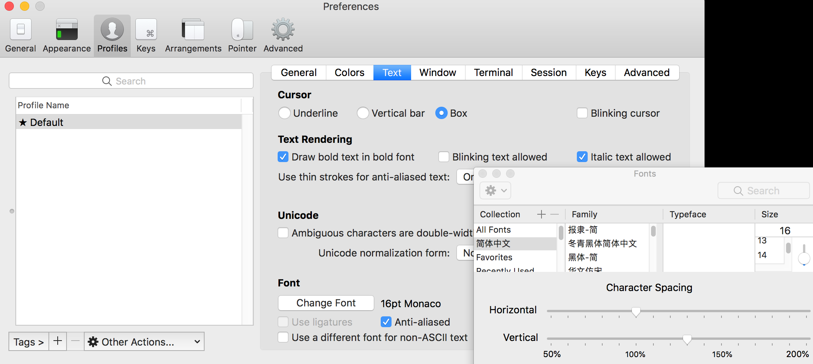
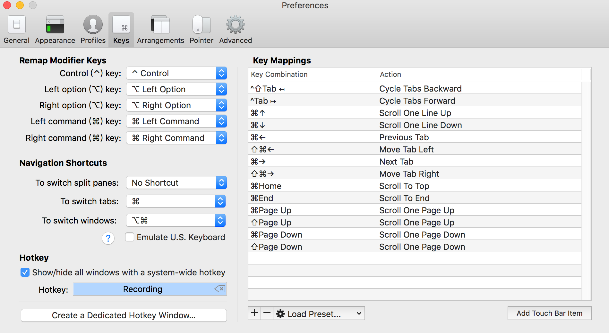

# iTerm2

[iTerm2](https://www.iterm2.com/) 是一个在 MacOS 下增强版功能的命令行终端，建议安装。

## 安装

[iTerm2](https://www.iterm2.com/) 的安装有两种方式，一种是通过 brew 命令安装，另一种是通过网站下载最新的压缩包文件。

::: code-group

```bash [通过 homebrew 安装]
brew install iterm2
```

```bash [通过访问网站下载]
# 将下载后的 .zip 压缩包解压，并将解压缩后的 `.app` 文件移动到`/Applications` 目录
wget -O ~/Desktop/iterm2.zip https://iterm2.com/downloads/stable/latest
```

## 配置

iTerm2 提供了丰富的配置选项，可以根据自己的需求进行配置。 使用快捷键 `Command + ,` 打开 iTerm2 的设置。

### 打开新窗口停留在上一次的路径

- 快捷键 `Command+,` ->> `Profiles` ->> 选中当前项目名 ->> 选择`Reuse Pevious session's directory`



### 修改字体大小和行间距

- 快捷键 `Command+,` ->> `Profiles` ->> 选中当前项目名 ->> 在右侧 Tabs 中选择 Text 选项 ->> 找到 Font 选项，点击进入字体配置。

字体大小选择为： `16pt`，行间距为：`130%`。



### 设置快速切换快捷键

- 快捷键 `Command+,` ->> 选择 `Keys` ->> 找到 HotKey，并点击记录你的快捷键，我这里使用的是 **Command + \`**



设置好快捷键之后，在任意界面使用快捷键都能快速切换 iTerm2。

### 设置正确的SSH连接字符集

sshd 配置文件在 `/etc/ssh/ssh_config`，可以通过对这个文件编写一些自定义配置。

#### No such file or directory

当我们需要使用SSH连接远程服务器，会报如下错误：

::: danger 报错
-bash: warning: setlocale: LC_CTYPE: cannot change locale (UTF-8): No such file or directory
:::

在 `/etc/ssh/ssh_config` 文件的末尾，将 `SendEnv LANG LC_*` 使用`#`注释，添加指定的字符集 `SendEnv LANG LC_ALL=en_US.UTF-8`，如下：

```yaml {2,3}
Host *
        #SendEnv LANG LC_* # 注释默认配置
        SendEnv LANG LC_ALL=en_US.UTF-8 # 添加这一行
```

相关链接[查看这里](https://segmentfault.com/a/1190000022755839)

#### 服务端乱码

默认SSH配置链接到服务器上编辑文件时可能出现乱码。

可以禁用 SSH locale 环境变量转发来修复这个错误，在本地计算机上打开 SSH 客户端配置文件 `/etc/ssh/ssh_config`，找到这一行：

```
SendEnv LANG LC_*
```

在开头加 `#` 号将其注释掉，保存文件后再次链接服务器查看是否乱码问题解决。

相关链接[查看这里](https://www.linuxbabe.com/linux-server/fix-ssh-locale-environment-variable-error)