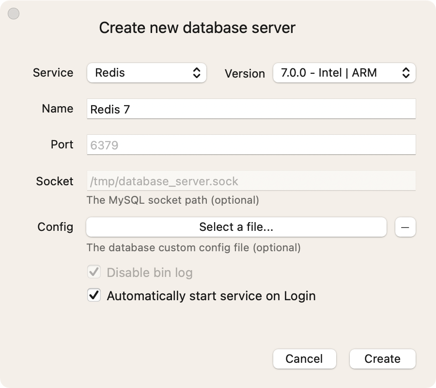

# Redis

Redis 作为最流程的内存数据库，在开发和生产环境中都得到了广泛的应用。

## 安装 DBngin

[DBngin](https://dbngin.com/) 是一个数据库管理工具，它可以帮助启动 Redis，同时它也能快速的启动 MySQL 和 PostgreSQL。

```bash
brew install --cask dbngin
```

## 启动 Redis

打开 DBngin，点击添加一个 Redis 服务，版本选择 7.0.0，然后点击启动。




