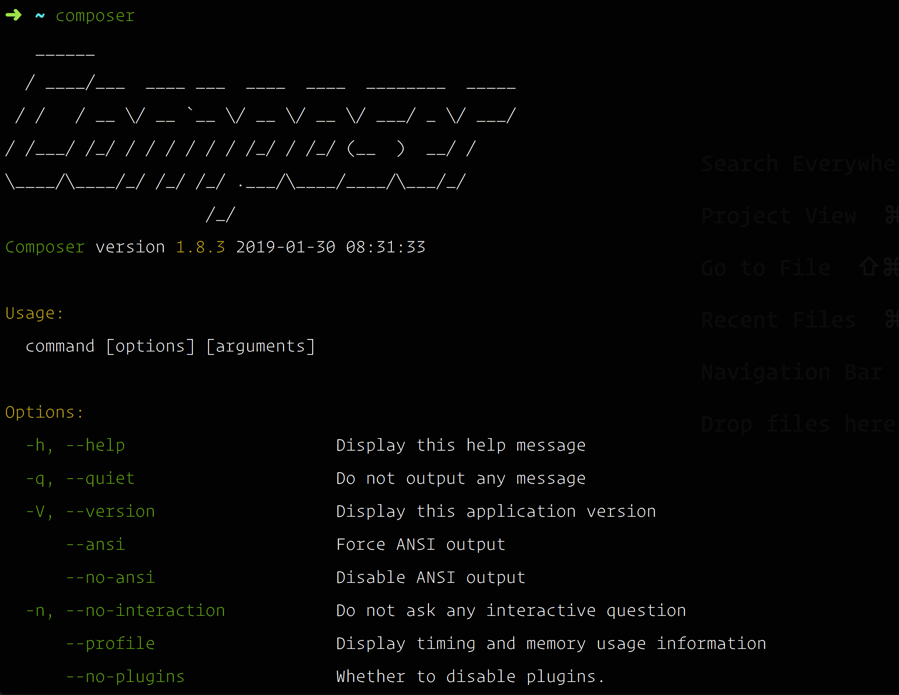

## 安装 Composer

## 安装命令

```bash
php -r "copy('https://getcomposer.org/installer', 'composer-setup.php');"
php -r "if (hash_file('sha384', 'composer-setup.php') === '756890a4488ce9024fc62c56153228907f1545c228516cbf63f885e036d37e9a59d27d63f46af1d4d07ee0f76181c7d3') { echo 'Installer verified'; } else { echo 'Installer corrupt'; unlink('composer-setup.php'); } echo PHP_EOL;"
php composer-setup.php
php -r "unlink('composer-setup.php');"
```

> See: [getcompose v1.10.7](https://getcomposer.org/download/)

## 移动到全局 bin 路径

```bash
sudo mv composer.phar /usr/local/bin/composer
```

> 通过上面的命令将可执行文件 composer 移动到全局 bin 路径



默认情况下安装的 composer 为 2.0.11 的版本。切换到 1.10.20

```bash
composer self-update --1
```

检查并确定下版本

```bash
composer -V
```

## 将 Composer 包关联的命令添加到 bin

```bash
export PATH="$PATH:$HOME/.composer/vendor/bin" # MacOSX 配置

sudo echo 'export PATH="$PATH:$HOME/.config/composer/vendor/bin"' >> /etc/profile # CentOS 配置
```
