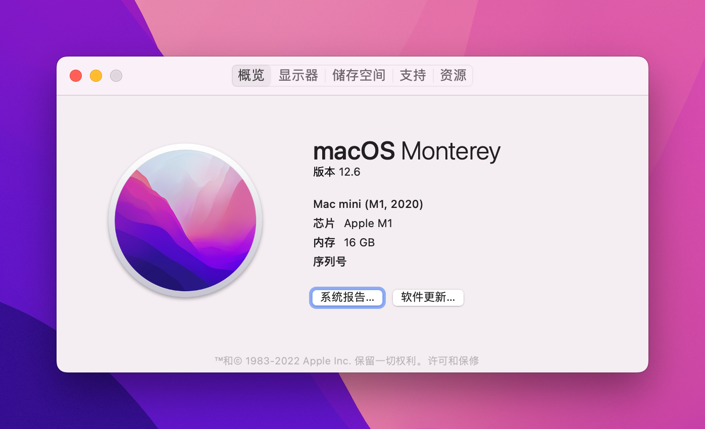
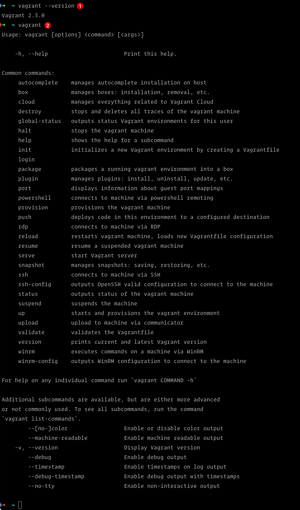
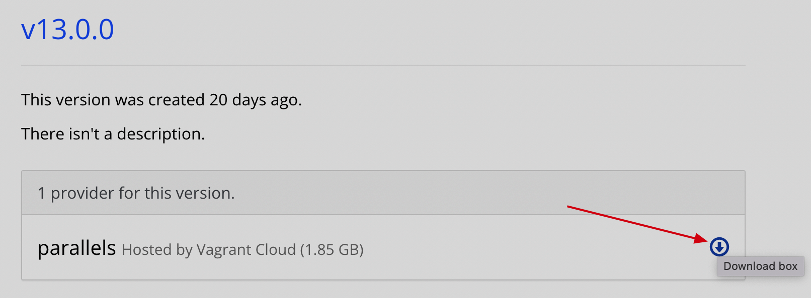
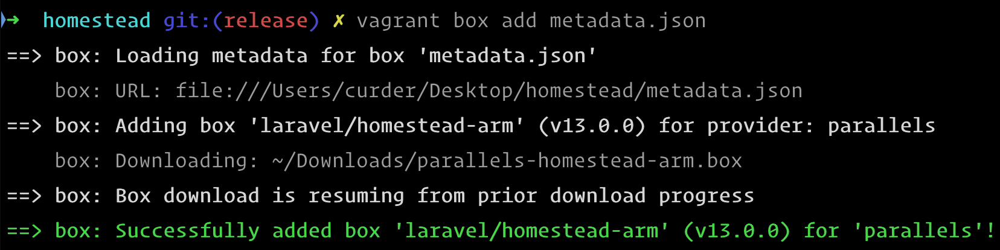
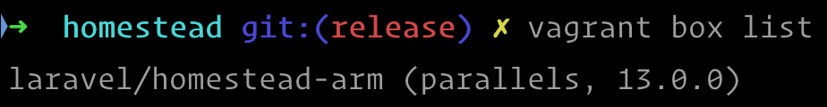
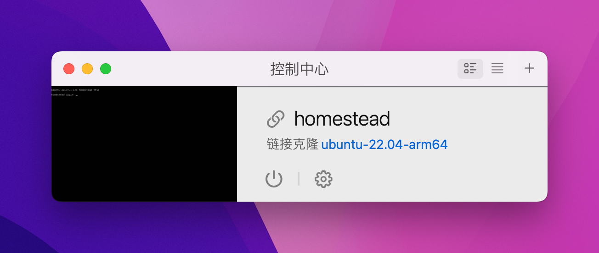
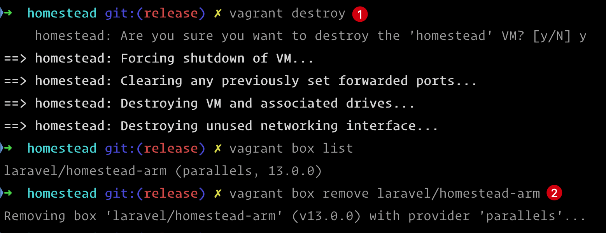

# Apple M1 上安装 Homestead

Homestead 提供了一个统一的 Laravel 开发环境，而无需在本地机器上安装 PHP、Web 服务器和任何其他服务器软件。

## 前置准备

环境要求：

- `Apple M1` 系统
- 系统版本大于或等于 `macOS Monterey 12`
  

## 软件安装

### Parallels Desktop 18 for Mac

在 [Parallels Desktop 18 for Mac 官方地址](https://www.parallels.com/products/desktop/trial/)下载并安装到 Mac
电脑。软件默认有 14 天的试用期。

### Vagrant

在 [Vagrant 官方地址](https://www.vagrantup.com/downloads) 下载 `vagrant` 并安装到本地，软件开源免费。

通过下面的方式验证是否正常：



### Homestead

- 下载 [Homestead](https://github.com/laravel/homestead.git)
  ```bash
  # Homestead 源码下载到本地的 `~/Homestead` 可以根据需要修改存放位置
  HOMESTEAD_PATH=~/Homestead
  git clone https://github.com/laravel/homestead.git $HOMESTEAD_PATH 
  cd $HOMESTEAD_PATH
  git checkout release
  bash init.sh
  ```

- 配置 Homestead

    - 安装 `vagrant-parallels` 插件
      Vagrant支持 [VirtualBox](https://www.virtualbox.org/wiki/Downloads)
      和 [Parallels](https://www.parallels.com/products/desktop/)
      ```bash
      vagrant plugin install vagrant-parallels
      ```
      > 由于这里选择的是 Parallels
      方案，所以将需要安装 [Parallels Vagrant](https://github.com/Parallels/vagrant-parallels) 插件。这个是免费的。

    - 修改 `Homestead.yaml` 文件中的 `provider` 键配置为：`parallels`：

      ```yaml {5}
      ---
      ip: "192.168.56.56"
      memory: 2048
      cpus: 2
      provider: parallels
      ```

    - 修改 `scripts/homestead.rb` 文件代码逻辑
      ```text {2}
      # 修改前
      config.vm.box = settings['box'] ||= 'laravel/homestead'
      config.vm.box_version = settings['version'] ||= '>= 12.0.0, < 13.0.0'
      
      # 修改后
      config.vm.box = settings['box'] ||= 'laravel/homestead-arm'
      config.vm.box_version = settings['version'] ||= '>= 12.0.0, <= 13.0.0'
      ```
      > 由于当前下载的 laravel/homestead-arm 为 `13.0.0` 所以需要修改一下版本限定条件

  > 更多Homestead 配置请看 [查看文档](https://laravel.com/docs/9.x/homestead#configuring-homestead)。

- 安装 [laravel/homestead-arm](https://app.vagrantup.com/laravel/boxes/homestead-arm)

  > 这里通过将box下载到本地的方式，在通过路径指定box的形式进行安装，能增加成功率。

    - 下载当前最新版本的Box, [v13.0.0](https://app.vagrantup.com/laravel/boxes/homestead-arm/versions/13.0.0)

      
      > 假如下载到本地 `~/Downloads` 目录下，并将下载后命名为 `parallels-homestead-arm.box`

    - 使用 `vagrant box add` 添加到 Vagrant

    - 编写文件 `metadata.json` 内容如下：
        ```json {2,4,6-7}
        {
          "name": "laravel/homestead-arm",
          "versions": [{
            "version": "13.0.0",
            "providers":[{
              "name": "parallels",
              "url": "~/Downloads/parallels-homestead-arm.box"
             }]
           }]
         }
        ```
        - 执行命令 `vagrant box add metadata.json`

          

          > 镜像文件被添加到 `~/.vagrant.d/boxes` 目录下

        - 执行命令查看是否正常添加
        ```bash
        vagrant box list
        ```
      

## 启动

```bash
vagrant up
vagrant up homestead # 指定名称
```

使用上面的命令可以启动 vagrant，并在 Parallels Desktop 中看到 Homestead 的镜像，如下图所示：



## 连接 Homestead 虚拟机

```bash
vagrant ssh
ssh -i ~/.ssh/id_rsa vagrant@192.168.56.56 # 使用ssh方式登录
```

## 卸载

- 卸载 Homestead 虚拟机

```bash
vagrant destroy homestead
```

- 删除 Box

```bash
vagrant box remove laravel/homestead-arm
```



再依次卸载 `Vagrant` 和 `Palallels Desktop 18 for Mac` 即可。

## Vagrant常用命令

| 命令                                                       | 简单说明                    |
|----------------------------------------------------------|-------------------------|
| `vagrant init [options] [name [url]]`                    | 初始化box的操作               |
| `vagrant up [options] [name or id]`                      | 启动虚拟机的操作                |
| `vagrant ssh [options] [name or id] [-- extra ssh args]` | 登录虚拟机的操作                |
| `vagrant box add [options] <name, url, or path>`         | 添加box的操作                |
| `vagrant box remove <name>`                              | 删除某个box                 |
| `vagrant box list`                                       | 查看box列表                 |
| `vagrant box remove`                                     | 删除相应的box                |
| `vagrant destroy [options] [name or id]`                 | 停止当前正在运行的虚拟机并销毁所有创建的资源  |
| `vagrant halt [options] [name or id]`                    | 关闭虚拟机                   |
| `vagrant package [options] [name or id]`                 | 打包命令，可以把当前的运行的虚拟机环境进行打包 |
| `vagrant reload [vm-name]`                               | 重新启动虚拟机，主要用于重新载入配置文件    |
| `vagrant suspend [name or id]`                           | 挂起当前虚拟机                 |
| `vagrant resume [vm-name]`                               | 恢复被挂起的状态                |
| `vagrant ssh-config [options] [name or id]`              | 输出用于ssh连接的一些信息          |
| `vagrant status [name or id]`                            | 获取当前虚拟机的状态              |


