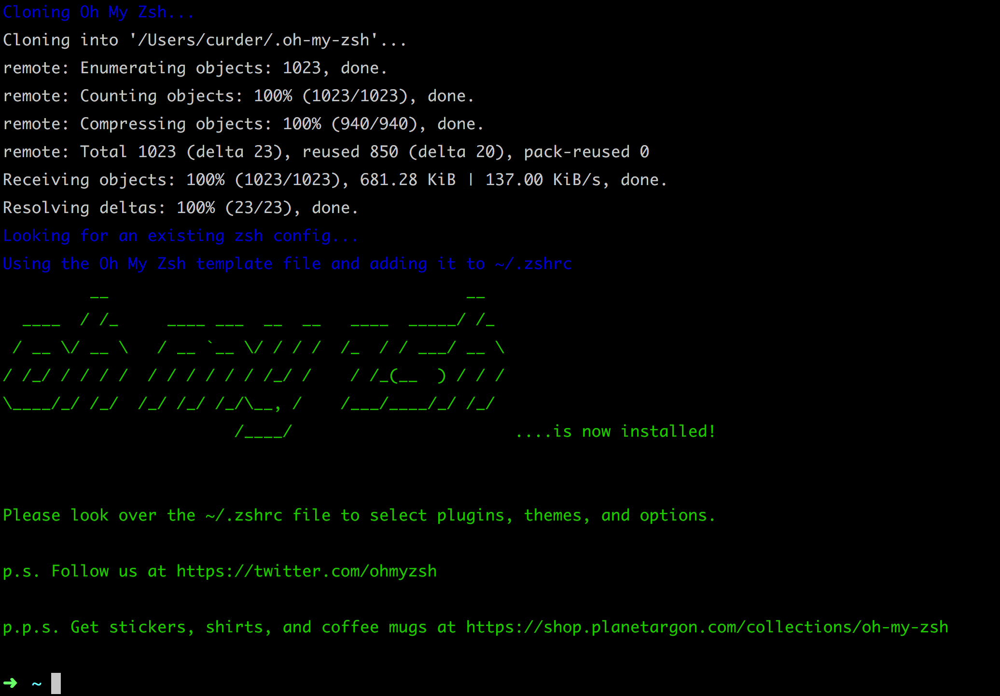

# 安装 Oh-My-Zsh

[Oh My Zsh](http://ohmyz.sh/) 的简单配置能让我们快速使用 zsh 这个 SHELL 给开发者带来很多愉悦，节省时间。

## 安装 zsh

Mac 下的安装 在 Mac 系统下默认自带 zsh，我们可以使用 brew 命令更新一下。

```bash
brew install zsh
```

## 切换到 zsh 并检查

```bash
chsh -s `which zsh` root # 为root用户修改默认shell为zsh

chsh -s /bin/zsh # 为当前用户修改默认shell为zsh

chsh -s /bin/bash # 恢复bash命令
```

执行上面的命令需要输入当前用户的密码后确认切换至 `zsh` ，然后注销当前会话并重新连接后查看是否真正切换至 `zsh`。

## 安装 Oh-My-Zsh

- curl 和 wget 两种安装方式二选一即可

```bash
sh -c "$(curl -fsSL https://raw.github.com/robbyrussell/oh-my-zsh/master/tools/install.sh)" # 通过curl进行安装
sh -c "$(wget https://raw.github.com/robbyrussell/oh-my-zsh/master/tools/install.sh -O -)" # 通过wget进行安装
```

安装成功后显示一个如下的欢迎界面



至此，Oh-My-Zsh 的安装已经完毕。

## 配置

[简单配置 Oh-My-Zsh](/config/oh-my-zsh.md)
