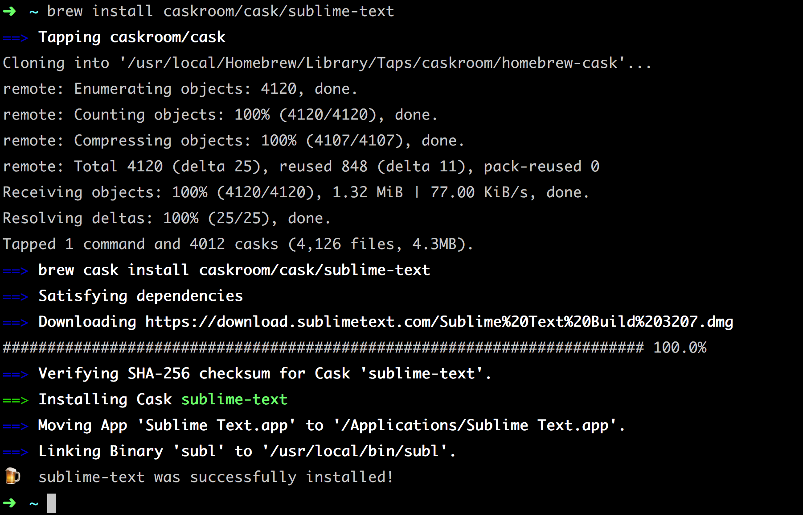
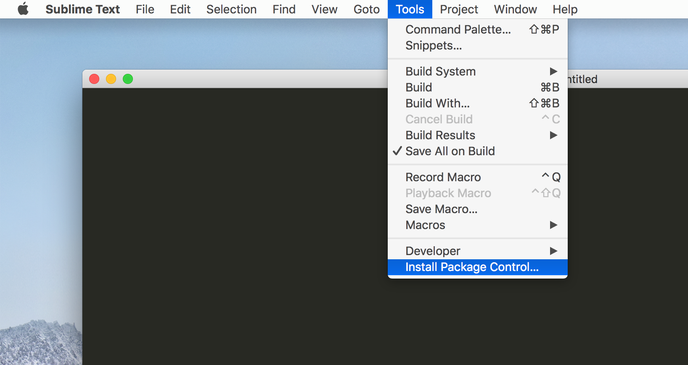

# 安装 Sublime Text 3

Sublime Text 3 的[官方网站](https://www.sublimetext.com/)，找到适合自己的平台进行下载并安装。

这里选择使用 Homebrew 进行安装。

```bash
brew install caskroom/cask/sublime-text
```



> 从命令行的提示中可以看出默认已经建立了一个 `subl` 的软连接，后期在使用中可以在命令行直接呼出 sublime text 3。

## 安装 Package Control

- 在 `Sublime Text 3` 顶级菜单的 `Tools` 下点击 `Install Package Control...`，稍等片刻即可安装成功。如下图：
  

- 使用快捷键`⌘(Command) + ⇧(Shift) + P`，输入 `Install Package Control` 字符后点击回车完成安装。

## 卸载

使用快捷键`Command + Shift + p`，输入`Package Control: Remove Package`字符后点击回车完成卸载。

## 使用

通过`Package Control`能很方便的安装其它插件。

### 安装插件

这里以`Emmet`插件的安装为例，一般插件的安装都可以通过这种方式。

使用快捷键`Command + Shift + p`，输入`Install Package`字符后再输入要安装的插件名称`Emmet`回车等待安装完成。

### 卸载插件

使用快捷键`Command + Shift + p`，输入`Remove Package`字符后再输入要安装的插件名称`Emmet`回车等待安装完成。

### 禁用插件

使用快捷键`Command + Shift + p`，输入`Disable Package`字符后再输入要安装的插件名称禁用插件。（其实就是在个人配置中的`ignored_packages`中添加插件名称。）

> 使用这个命令可以禁用系统默认安装的插件。

### 启用插件

使用快捷键`Command + Shift + p`，输入`Enable Package`字符后再输入要安装的插件名称禁用插件。（其实就是在个人配置中的`ignored_packages`中移除插件名称。）

### 插件列表

使用快捷键`Command + Shift + p`，输入`List Package`字符后查看当前环境已经安装的插件。

## 命令关键字

- `Install Package` 升级插件
- `Remove Package` 移除插件
- `Disable Package` 禁用插件
- `Enable Package` 启用插件
- `List Package` 插件列表

## 插件

TODO
